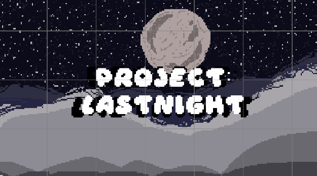
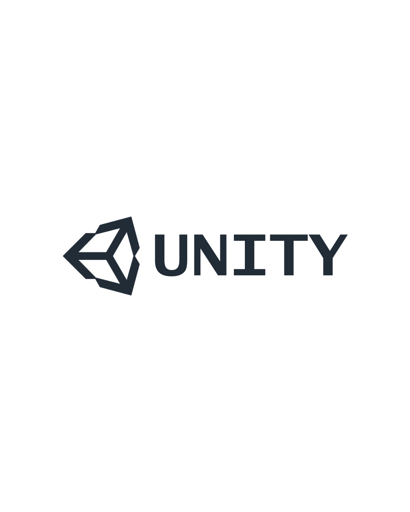
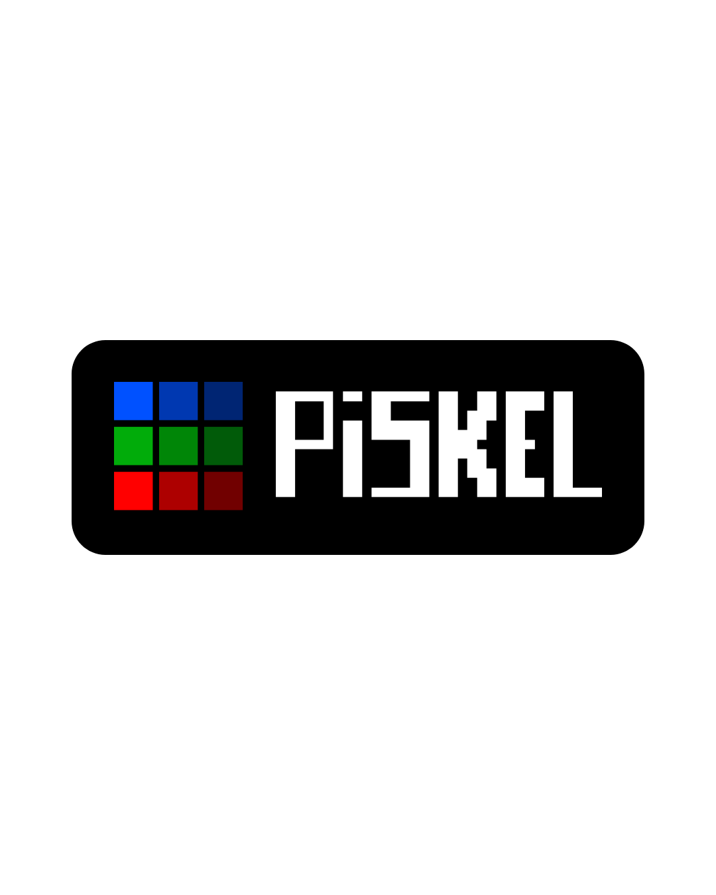
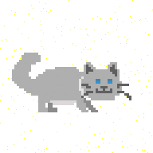

   

# Game Description
Project: LASTNIGHT is a short and simple 2D platformer game. This game is the first game BigDrewChicken created; a passion project dedicated to his girlfriend and is a gift for her on their 2nd Anniversary. The name "LASTNIGHT" came from the 
song <i><a href="https://open.spotify.com/track/5TpPSTItCwtZ8Sltr3vdzm"> Last Night on Earth by Green Day</a></i> which served as both an inspiration to the game's theme as well as motivation for the project's creation.

# How to Play

Please click the header image at the top of this README to be redirected to the game.  
_Note: The game runs purely on WebGL via UnityPlay and requires a keyboard._

**Standard Controls:**

| Action | Key |
|--------|-----|
| Move Left | A |
| Move Right | D |
| Jump | Spacebar |

# Software

  
  
  

  

    I used Unity as my game engine and used Piskel (a free web-based pixel sprite editor) as my assets / animation maker. In terms of scripting, I watched YouTube for tutorials and used a bit of Generative Artificial Intelligence for help in debugging.
  

# Character

  
  
  

    <i> Apologies for the yellow static, I have no clue why it appeared after exporting the animation as a GIF in PISKEL</i>
  

  

    The main character is named "Iris", based on my real-life girlfriend's name. The choice of using a munchkin cat as the character is purely out of personal desire; rather, is a direct reference to my girlfriend's favorite type of cat, the Munchkin.   
    <i>Reference Image: <a href="https://www.catster.com/cat-breeds/grey-munchkin-cat/"> Gray Munchkin Cat </a><i/>
  

# Sound Effects and Music

  
  

    
All Sound Links:  

    <a href="https://youtu.be/DORcfgGDRqs?si=ArCAzXlJNm4SovKF"> Checkpoint</a><i/> 
    <a href="https://youtu.be/IeUfgC-RHZ0?si=oCuADL0pre8SKBS4"> Death</a><i/> 
    <a href="https://youtu.be/teUWsONJkk8?si=H9sy77N8KtwWOO6a"> Victory</a><i/>  
    

      Huge shoutout to Pix for their amazing pixel music, all for free! Check out their channel: <a href="https://www.youtube.com/@Pixverses"> Pix's Youtube Channel</a>
    

    <a href="https://www.youtube.com/watch?v=L8MztYFyyHc"> Main Menu (Astral Bunny)</a><i/> 
    <a href="https://youtu.be/G2nmOULeOBQ?si=Gc72NpV6Po2GDKOC"> Level Music (Space travel)</a><i/> 
  

